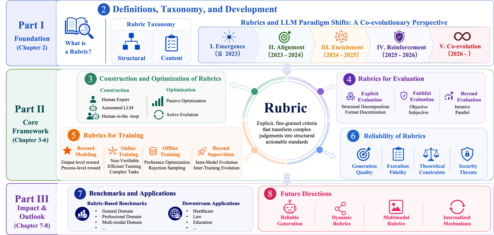
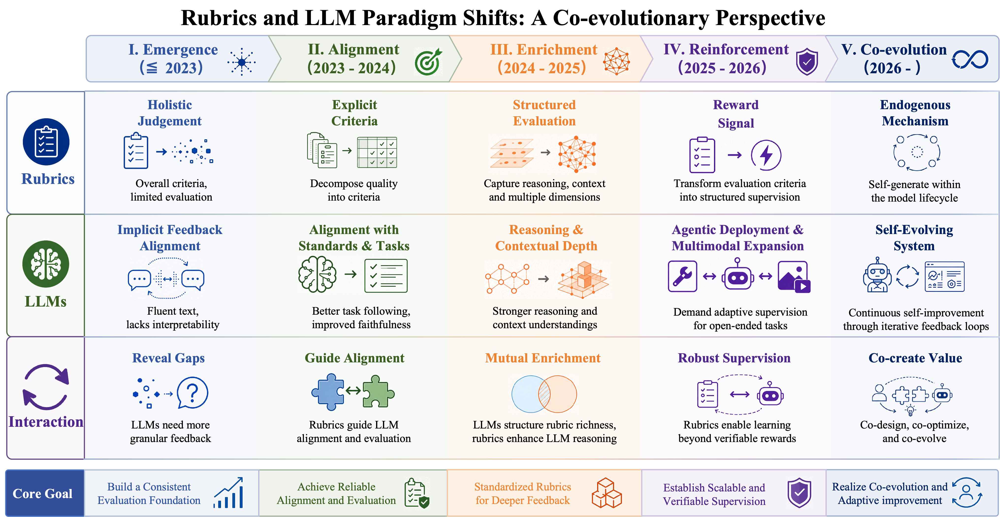
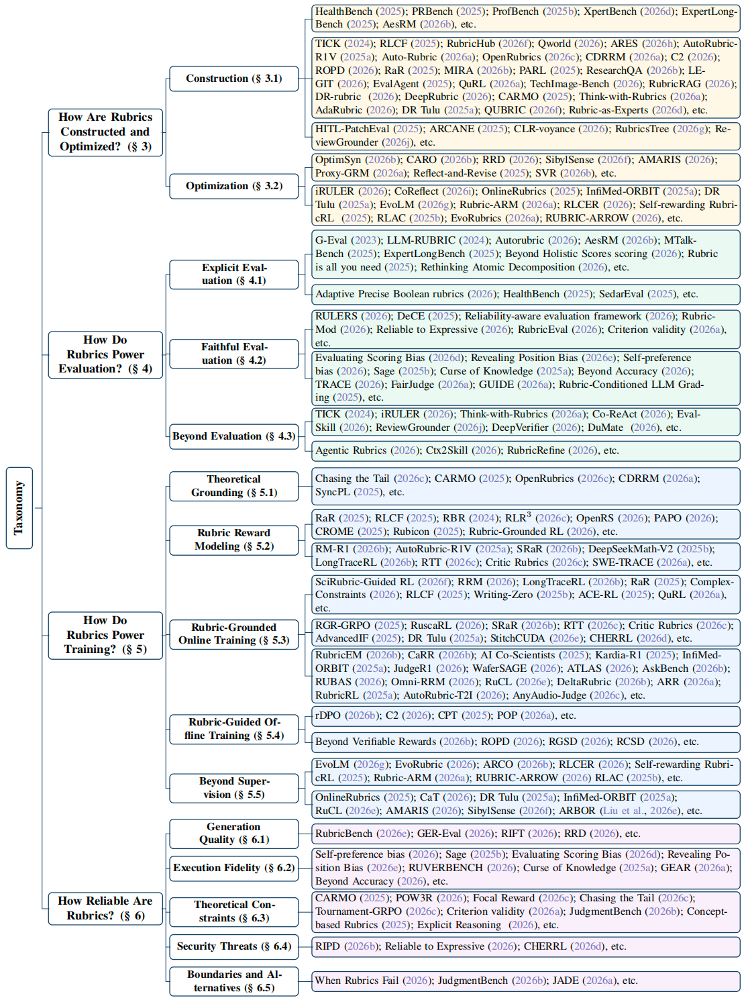

#  From Holistic Evaluation to Structured Criteria: A Survey of Rubrics Across the Evolving LLM Landscape

<p align="center">
  <a href="https://doi.org/10.13140/RG.2.2.14801.08806"></a>
  <a href="https://ai9stars.github.io/LLM-Rubrics-Survey/paper.pdf">
</a>
  <a href="https://github.com/AI9Stars/LLM-Rubrics-Survey"></a>
</p>

💡 **Suggestions welcome!** If you find any missing works or recently published papers relevant to this survey, feel free to open an issue. We will continuously maintain and update this repository.

## 📌 Overview

This survey introduces the **rubric** as a unifying framework for understanding how LLM evaluation and alignment have co-evolved with successive paradigm shifts. We define a rubric as an explicit set of criteria that transforms complex quality judgments into structured, actionable standards, and demonstrate that their recurrence across otherwise independent efforts in evaluation, reinforcement learning, and safety alignment is not coincidental, but a structural necessity.

The survey is organized into three interconnected parts covering the conceptual foundations of rubrics, a full methodological framework (construction, evaluation, training, and reliability), and a broad synthesis of benchmarks, applications, and future directions.

<p align="center">      <br><em>Figure 1: Conceptual organization of this survey.</em> </p>

------

## 🔑 Core Contributions

### C1: A Co-evolutionary Perspective on Rubrics and LLMs

We introduce the first framework that situates rubric development within successive LLM paradigm shifts. Rather than treating rubrics as isolated tools, we show that each leap in model capability, from alignment to reasoning, agentic deployment, and self-evolution, has structurally demanded a more sophisticated form of rubric. This co-evolutionary perspective reveals why rubrics have independently recurred across evaluation, RL, and safety research threads, and traces their progression from external evaluation instruments to endogenous mechanisms for self-improvement.

<p align="center">      <br><em>Figure 2: The co-evolutionary development of rubrics and LLMs across five paradigm phases.</em> </p>

### C2: Full Rubric Lifecycle and Reliability Boundaries

We systematically examine rubrics across their complete lifecycle: how they are constructed, how they are optimized from passive refinement to active co-evolution with model capabilities, and how they function as evaluation criteria, training signals, and ultimately endogenous mechanisms within the model itself.

We further conduct the first rigorous reliability analysis of rubrics from multiple independent perspectives, covering generation quality, execution fidelity, theoretical constraints, and security threats, revealing that rubric reliability is stratified across dimensions that must each be addressed for evaluation to be trustworthy as a whole.

<p align="center">      <br><em>Figure 3: Taxonomy of rubric research across construction, evaluation, training, and reliability.</em> </p>

### C3: Benchmarks, Applications, and Research Roadmap

We provide the comprehensive synthesis of rubric-based benchmarks spanning general, professional, deep research, multimodal, and academic categories, and downstream applications across healthcare, law, education, finance, society, and scientific research. Across all domains, a shared tension recurs: translating the implicit judgment standards of domain experts into explicit, programmatically verifiable criteria without sacrificing the depth that makes those standards meaningful.

We conclude with four open research directions (reliable rubric generation, dynamic rubric design, multimodal extension, and rubric internalization) that together define the trajectory toward scalable supervision and self-evolving aligned AI systems.

------

## 🗺️ Survey Structure

```
Part I: Foundation
  └── Chapter 2: What Is a Rubric? Definitions, Taxonomy, and Paradigm Shifts

Part II: Core Framework
  ├── Chapter 3: How Are Rubrics Constructed and Optimized?
  ├── Chapter 4: How Do Rubrics Power Evaluation?
  ├── Chapter 5: How Do Rubrics Power Training?
  └── Chapter 6: How Reliable Are Rubrics?

Part III: Impact and Outlook
  ├── Chapter 7: Where Are Rubrics Applied?
  └── Chapter 8: Where Does Rubric Research Head?
```

------

## 📖 Citation

If you find this survey useful, please cite:

```bibtex
@article{chen2026rubrics,
  title   = {From Holistic Evaluation to Structured Criteria: A Survey of Rubrics Across the Evolving LLM Landscape},
  author  = {Hao Chen and Ziyu Han and Yukun Yan and Qingfu Zhu and Maosong Sun and Wanxiang Che},
  year    = {2026},
  doi     = {10.13140/RG.2.2.14801.08806},
  url     = {https://doi.org/10.13140/RG.2.2.14801.08806}
}
```

------

## 📚 Paper List

### How Are Rubrics Constructed and Optimized?

#### Construction: How Rubrics Are Built

##### Human Expert Construction

1. **HealthBench: Evaluating Large Language Models Towards Improved Human Health**, _Arora et al._, arXiv 2025. [[Paper](https://arxiv.org/pdf/2505.08775.pdf)]
2. **PRBench: Large-Scale Expert Rubrics for Evaluating High-Stakes Professional Reasoning**, _Akyürek et al._, arXiv 2025. [[Paper](https://arxiv.org/pdf/2511.11562.pdf)]
3. **ProfBench: Multi-Domain Rubrics requiring Professional Knowledge to Answer and Judge**, _Wang et al._, arXiv 2025. [[Paper](https://arxiv.org/pdf/2510.18941.pdf)]
4. **Xpertbench: Expert Level Tasks with Rubrics-Based Evaluation**, _Liu et al._, arXiv 2026. [[Paper](https://arxiv.org/pdf/2604.02368.pdf)]
5. **ExpertLongBench: Benchmarking Language Models on Expert-Level Long-Form Generation Tasks with Structured Checklists**, _Ruan et al._, arXiv 2025. [[Paper](https://arxiv.org/pdf/2506.01241.pdf)]
6. **AesRM: Improving Video Aesthetics with Expert-Level Feedback**, _Han et al._, arXiv 2026. [[Paper](https://arxiv.org/pdf/2604.28078.pdf)]

##### Automated LLM Construction

1. **TICKing All the Boxes: Generated Checklists Improve LLM Evaluation and Generation**, _Cook et al._, arXiv 2024. [[Paper](https://arxiv.org/pdf/2410.03608.pdf)]
2. **Checklists Are Better Than Reward Models For Aligning Language Models**, _Viswanathan et al._, arXiv 2025. [[Paper](https://arxiv.org/pdf/2507.18624.pdf)]
3. **RubricHub: A Comprehensive and Highly Discriminative Rubric Dataset via Automated Coarse-to-Fine Generation**, _Li et al._, arXiv 2026. [[Paper](https://arxiv.org/pdf/2601.08430.pdf)]
4. **Qworld: Question-Specific Evaluation Criteria for LLMs**, _Gao et al._, arXiv 2026. [[Paper](https://arxiv.org/pdf/2603.23522.pdf)]
5. **AutoRubric-R1V: Rubric-Based Generative Rewards for Faithful Multimodal Reasoning**, _Jia et al._, arXiv 2025. [[Paper](https://arxiv.org/pdf/2510.14738.pdf)]
6. **Auto-Rubric: Learning From Implicit Weights to Explicit Rubrics for Reward Modeling**, _Xie et al._, arXiv 2025. [[Paper](https://arxiv.org/pdf/2510.17314.pdf)]
7. **OpenRubrics: Towards Scalable Synthetic Rubric Generation for Reward Modeling and LLM Alignment**, _Liu et al._, arXiv 2025. [[Paper](https://arxiv.org/pdf/2510.07743.pdf)]
8. **CDRRM: Contrast-Driven Rubric Generation for Reliable and Interpretable Reward Modeling**, _Liu et al._, arXiv 2026. [[Paper](https://arxiv.org/pdf/2603.08035.pdf)]
9. **C2: Scalable Rubric-Augmented Reward Modeling from Binary Preferences**, _Kawabata et al._, arXiv 2026. [[Paper](https://arxiv.org/pdf/2604.13618.pdf)]
10. **Rubric-based On-policy Distillation**, _Fang et al._, arXiv 2026. [[Paper](https://arxiv.org/pdf/2605.07396.pdf)]
11. **Generating Data-Driven Reasoning Rubrics for Domain-Adaptive Reward Modeling**, _Sanders et al._, arXiv 2026. [[Paper](https://arxiv.org/pdf/2602.06795.pdf)]
12. **Inference-Time Scaling of Verification: Self-Evolving Deep Research Agents via Test-Time Rubric-Guided Verification**, _Wan et al._, arXiv 2026. [[Paper](https://arxiv.org/pdf/2601.15808.pdf)]
13. **Rubrics as Rewards: Reinforcement Learning Beyond Verifiable Domains**, _Gunjal et al._, arXiv 2025. [[Paper](https://arxiv.org/pdf/2507.17746.pdf)]
14. **ResearchQA: Evaluating Scholarly Question Answering at Scale Across 75 Fields with Survey-Mined Questions and Rubrics**, _Yifei et al._, arXiv 2025. [[Paper](https://arxiv.org/pdf/2509.00496.pdf)]
15. **Evaluating Legal Reasoning Traces with Legal Issue Tree Rubrics**, _Lee et al._, arXiv 2025. [[Paper](https://arxiv.org/pdf/2512.01020.pdf)]
16. **EvalAgent: Discovering Implicit Evaluation Criteria from the Web**, _Wadhwa et al._, arXiv 2025. [[Paper](https://arxiv.org/pdf/2504.15219.pdf)]
17. **QuRL: Rubrics As Judge For Open-Ended Question Answering**, _Wei et al._, ICLR 2026.
18. **TechImage-Bench: Rubric-Based Evaluation for Technical Image Generation**, _Ni et al._, arXiv 2025. [[Paper](https://arxiv.org/pdf/2512.12220.pdf)]
19. **RubricRAG: Towards Interpretable and Reliable LLM Evaluation via Domain Knowledge Retrieval for Rubric Generation**, _Dhole et al._, arXiv 2026. [[Paper](https://arxiv.org/pdf/2603.20882.pdf)]
20. **RM-R1: Reward Modeling as Reasoning**, _Chen et al._, arXiv 2025. [[Paper](https://arxiv.org/pdf/2505.02387.pdf)]
21. **CARMO: Dynamic Criteria Generation for Context-Aware Reward Modelling**, _Gupta et al._, arXiv 2024. [[Paper](https://arxiv.org/pdf/2410.21545.pdf)]
22. **Think-with-Rubrics: From External Evaluator to Internal Reasoning Guidance**, _Yu et al._, arXiv 2026. [[Paper](https://arxiv.org/pdf/2605.07461.pdf)]
23. **Compute as Teacher: Turning Inference Compute Into Reference-Free Supervision**, _Jayalath et al._, arXiv 2025. [[Paper](https://arxiv.org/pdf/2509.14234.pdf)]
24. **Are We on the Right Way to Assessing LLM-as-a-Judge?**, _Feng et al._, arXiv 2025. [[Paper](https://arxiv.org/pdf/2512.16041.pdf)]
25. **DeltaRubric: Generative Multimodal Reward Modeling via Joint Planning and Verification**, _Liu et al._, arXiv 2026. [[Paper](https://arxiv.org/pdf/2605.09269.pdf)]
26. **QA-LIGN: Aligning LLMs through Constitutionally Decomposed QA**, _Dineen et al._, Findings of ACL: EMNLP 2025. [[Paper](https://doi.org/10.18653/v1/2025.findings-emnlp.1123)]
27. **AdaRubric: Task-Adaptive Rubrics for Reliable LLM Agent Evaluation and Reward Learning**, _Ding_, arXiv 2026. [[Paper](https://arxiv.org/pdf/2603.21362.pdf)]
28. **Learning Query-Specific Rubrics from Human Preferences for DeepResearch Report Generation**, _Lv et al._, arXiv 2026. [[Paper](https://arxiv.org/pdf/2602.03619.pdf)]
29. **DR Tulu: Reinforcement Learning with Evolving Rubrics for Deep Research**, _Shao et al._, arXiv 2025. [[Paper](https://arxiv.org/pdf/2511.19399.pdf)]
30. **Bootstrapping Post-training Signals for Open-ended Tasks via Rubric-based Self-play on Pre-training Text**, _Huang et al._, arXiv 2026. [[Paper](https://arxiv.org/pdf/2604.20051.pdf)]

##### Human-in-the-Loop Construction

1. **Towards a Human-in-the-Loop Framework for Reliable Patch Evaluation Using an LLM-as-a-Judge**, _Shi et al._, arXiv 2025. [[Paper](https://arxiv.org/pdf/2511.10865.pdf)]
2. **ARCANE: A Multi-Agent Framework for Interpretable and Configurable Alignment**, _Masters et al._, arXiv 2025. [[Paper](https://arxiv.org/pdf/2512.06196.pdf)]
3. **Case-Specific Rubrics for Clinical AI Evaluation: Methodology, Validation, and LLM-Clinician Agreement Across 823 Encounters**, _Shah et al._, arXiv 2026. [[Paper](https://arxiv.org/pdf/2604.24710.pdf)]
4. **CLR-voyance: Reinforcing Open-Ended Reasoning for Inpatient Clinical Decision Support with Outcome-Aware Rubrics**, _Nagar et al._, arXiv 2026. [[Paper](https://arxiv.org/pdf/2605.09584.pdf)]
5. **ReviewGrounder: Improving Review Substantiveness with Rubric-Guided, Tool-Integrated Agents**, _Li et al._, arXiv 2026. [[Paper](https://arxiv.org/pdf/2604.14261.pdf)]

#### Optimization: How Rubrics Improve

##### Passive Optimization

1. **Optimsyn: Influence-Guided Rubrics Optimization for Synthetic Data Generation**, _Fan et al._, arXiv 2026. [[Paper](https://arxiv.org/pdf/2604.00536.pdf)]
2. **Confusion-Aware Rubric Optimization for LLM-based Automated Grading**, _Chu et al._, arXiv 2026. [[Paper](https://arxiv.org/pdf/2603.00451.pdf)]
3. **Rethinking Rubric Generation for Improving LLM Judge and Reward Modeling for Open-ended Tasks**, _Shen et al._, arXiv 2026. [[Paper](https://arxiv.org/pdf/2602.05125.pdf)]
4. **SibylSense: Adaptive Rubric Learning via Memory Tuning and Adversarial Probing**, _Xu et al._, arXiv 2026. [[Paper](https://arxiv.org/pdf/2602.20751.pdf)]
5. **AMARIS: A Memory-Augmented Rubric Improvement System for Rubric-Based Reinforcement Learning**, _Wu et al._, arXiv 2026. [[Paper](https://arxiv.org/pdf/2605.18592.pdf)]
6. **Rationale Matters: Learning Transferable Rubrics via Proxy-Guided Critique for VLM Reward Models**, _Qiu et al._, arXiv 2026. [[Paper](https://arxiv.org/pdf/2603.16600.pdf)]
7. **Automated Refinement of Essay Scoring Rubrics for Language Models via Reflect-and-Revise**, _Harada et al._, arXiv 2025. [[Paper](https://arxiv.org/pdf/2510.09030.pdf)]

##### Active Evolution

1. **iRULER: Intelligible Rubric-Based User-Defined LLM Evaluation for Revision**, _Bai et al._, arXiv 2026. [[Paper](https://arxiv.org/pdf/2602.12779.pdf)]
2. **CoReflect: Conversational Evaluation via Co-Evolutionary Simulation and Reflective Rubric Refinement**, _Li et al._, arXiv 2026. [[Paper](https://arxiv.org/pdf/2601.12208.pdf)]
3. **Online Rubrics Elicitation from Pairwise Comparisons**, _Rezaei et al._, arXiv 2025. [[Paper](https://arxiv.org/pdf/2510.07284.pdf)]
4. **InfiMed-ORBIT: Aligning LLMs on Open-Ended Complex Tasks via Rubric-Based Incremental Training**, _Wang et al._, arXiv 2025. [[Paper](https://arxiv.org/pdf/2510.15859.pdf)]
5. **DR Tulu: Reinforcement Learning with Evolving Rubrics for Deep Research**, _Shao et al._, arXiv 2025. [[Paper](https://arxiv.org/pdf/2511.19399.pdf)]
6. **EvoLM: Self-Evolving Language Models through Co-Evolved Discriminative Rubrics**, _Li et al._, arXiv 2026. [[Paper](https://arxiv.org/pdf/2605.03871.pdf)]
7. **Alternating Reinforcement Learning for Rubric-Based Reward Modeling in Non-Verifiable LLM Post-Training**, _Xu et al._, arXiv 2026. [[Paper](https://arxiv.org/pdf/2602.01511.pdf)]
8. **Reinforcing Chain-of-Thought Reasoning with Self-Evolving Rubrics**, _Sheng et al._, arXiv 2026. [[Paper](https://arxiv.org/pdf/2602.10885.pdf)]
9. **Self-Rewarding Rubric-Based Reinforcement Learning for Open-Ended Reasoning**, _Ye et al._, arXiv 2025. [[Paper](https://arxiv.org/pdf/2509.25534.pdf)]
10. **RLAC: Reinforcement Learning with Adversarial Critic for Free-Form Generation Tasks**, _Wu et al._, arXiv 2025. [[Paper](https://arxiv.org/pdf/2511.01758.pdf)]

### How Do Rubrics Power Evaluation?

#### Explicit Evaluation: Deconstruction and Representation of Criteria

##### Structural Decomposition

1. **LLM-Rubric: A Multidimensional, Calibrated Approach to Automated Evaluation of Natural Language Texts**, _Hashemi et al._, ACL 2024. [[Paper](https://doi.org/10.18653/v1/2024.acl-long.745)]
2. **Autorubric: Unifying Rubric-based LLM Evaluation**, _Rao et al._, arXiv 2026. [[Paper](https://arxiv.org/pdf/2603.00077.pdf)]
3. **AesRM: Improving Video Aesthetics with Expert-Level Feedback**, _Han et al._, arXiv 2026. [[Paper](https://arxiv.org/pdf/2604.28078.pdf)]
4. **MTalk-Bench: Evaluating Speech-to-Speech Models in Multi-Turn Dialogues via Arena-style and Rubrics Protocols**, _Du et al._, arXiv 2025. [[Paper](https://arxiv.org/pdf/2508.18240.pdf)]
5. **ExpertLongBench: Benchmarking Language Models on Expert-Level Long-Form Generation Tasks with Structured Checklists**, _Ruan et al._, arXiv 2025. [[Paper](https://arxiv.org/pdf/2506.01241.pdf)]
6. **Beyond Holistic Scores: Automatic Trait-Based Quality Scoring of Argumentative Essays**, _Favero et al._, arXiv 2026. [[Paper](https://arxiv.org/pdf/2602.04604.pdf)]
7. **Rubric Is All You Need: Improving LLM-Based Code Evaluation With Question-Specific Rubrics**, _Pathak et al._, ICER 2025. [[Paper](https://doi.org/10.1145/3702652.3744220)]
8. **Rethinking Atomic Decomposition for LLM Judges: A Prompt-Controlled Study of Reference-Grounded QA Evaluation**, _Zhang_, arXiv 2026. [[Paper](https://arxiv.org/pdf/2603.28005.pdf)]

##### Format Discretization

1. **A Scalable Framework for Evaluating Health Language Models**, _Mallinar et al._, arXiv 2025. [[Paper](https://arxiv.org/pdf/2503.23339.pdf)]
2. **HealthBench: Evaluating Large Language Models Towards Improved Human Health**, _Arora et al._, arXiv 2025. [[Paper](https://arxiv.org/pdf/2505.08775.pdf)]
3. **SedarEval: Automated Evaluation using Self-Adaptive Rubrics**, _Fan et al._, arXiv 2025. [[Paper](https://arxiv.org/pdf/2501.15595.pdf)]

#### Faithful Evaluation: Reliability Reinforcement of Judgment

##### Objective Evidence Anchoring

1. **RULERS: Locked Rubrics and Evidence-Anchored Scoring for Robust LLM Evaluation**, _Hong et al._, arXiv 2026. [[Paper](https://arxiv.org/pdf/2601.08654.pdf)]
2. **Beyond Pointwise Scores: Decomposed Criteria-Based Evaluation of LLM Responses**, _Yu et al._, arXiv 2025. [[Paper](https://arxiv.org/pdf/2509.16093.pdf)]
3. **LLM-as-a-Judge for Human-AI Co-Creation: A Reliability-Aware Evaluation Framework for Coding**, _Amin et al._, arXiv 2026. [[Paper](https://arxiv.org/pdf/2604.27727.pdf)]
4. **Quantifying the Statistical Effect of Rubric Modifications on Human-Autorater Agreement**, _Huynh et al._, arXiv 2026. [[Paper](https://arxiv.org/pdf/2605.06283.pdf)]
5. **RubricEval: A Rubric-Level Meta-Evaluation Benchmark for LLM Judges in Instruction Following**, _Pan et al._, arXiv 2026. [[Paper](https://arxiv.org/pdf/2603.25133.pdf)]
6. **Criterion Validity of LLM-as-Judge for Business Outcomes in Conversational Commerce**, _Chen et al._, arXiv 2026. [[Paper](https://arxiv.org/pdf/2604.00022.pdf)]

##### Subjective Bias Suppression

1. **Evaluating Scoring Bias in LLM-as-a-Judge**, _Li et al._, arXiv 2025. [[Paper](https://arxiv.org/pdf/2506.22316.pdf)]
2. **Am I More Pointwise or Pairwise? Revealing Position Bias in Rubric-Based LLM-as-a-Judge**, _Xu et al._, arXiv 2026. [[Paper](https://arxiv.org/pdf/2602.02219.pdf)]
3. **Self-Preference Bias in Rubric-Based Evaluation of Large Language Models**, _Pombal et al._, arXiv 2026. [[Paper](https://arxiv.org/pdf/2604.06996.pdf)]
4. **Are We on the Right Way to Assessing LLM-as-a-Judge?**, _Feng et al._, arXiv 2025. [[Paper](https://arxiv.org/pdf/2512.16041.pdf)]
5. **Curse of Knowledge: When Complex Evaluation Context Benefits yet Biases LLM Judges**, _Li et al._, arXiv 2025. [[Paper](https://arxiv.org/pdf/2509.03419.pdf)]
6. **Beyond Accuracy: Policy Invariance as a Reliability Test for LLM Safety Judges**, _Weng et al._, arXiv 2026. [[Paper](https://arxiv.org/pdf/2605.06161.pdf)]
7. **Comparing Developer and LLM Biases in Code Evaluation**, _Mittal et al._, arXiv 2026. [[Paper](https://arxiv.org/pdf/2603.24586.pdf)]
8. **FairJudge: An Adaptive, Debiased, and Consistent LLM-as-a-Judge**, _Yang et al._, arXiv 2026. [[Paper](https://arxiv.org/pdf/2602.06625.pdf)]
9. **Optimizing In-Context Demonstrations for LLM-based Automated Grading**, _Chu et al._, arXiv 2026. [[Paper](https://arxiv.org/pdf/2603.00465.pdf)]
10. **Rubric-Conditioned LLM Grading: Alignment, Uncertainty, and Robustness**, _Deng et al._, arXiv 2026. [[Paper](https://arxiv.org/pdf/2601.08843.pdf)]
11. **Leveraging LLMs as Meta-Judges: A Multi-Agent Framework for Evaluating LLM Judgments**, _Li et al._, arXiv 2025. [[Paper](https://arxiv.org/pdf/2504.17087.pdf)]

#### Beyond Evaluation: Capabilities Extension via Test-Time Scaling

##### Iterative Self-Refinement

1. **TICKing All the Boxes: Generated Checklists Improve LLM Evaluation and Generation**, _Cook et al._, arXiv 2024. [[Paper](https://arxiv.org/pdf/2410.03608.pdf)]
2. **iRULER: Intelligible Rubric-Based User-Defined LLM Evaluation for Revision**, _Bai et al._, arXiv 2026. [[Paper](https://arxiv.org/pdf/2602.12779.pdf)]
3. **Think-with-Rubrics: From External Evaluator to Internal Reasoning Guidance**, _Yu et al._, arXiv 2026. [[Paper](https://arxiv.org/pdf/2605.07461.pdf)]
4. **ReviewGrounder: Improving Review Substantiveness with Rubric-Guided, Tool-Integrated Agents**, _Li et al._, arXiv 2026. [[Paper](https://arxiv.org/pdf/2604.14261.pdf)]
5. **Inference-Time Scaling of Verification: Self-Evolving Deep Research Agents via Test-Time Rubric-Guided Verification**, _Wan et al._, arXiv 2026. [[Paper](https://arxiv.org/pdf/2601.15808.pdf)]

##### Parallel Path Selection

1. **Agentic Rubrics as Contextual Verifiers for SWE Agents**, _Raghavendra et al._, arXiv 2026. [[Paper](https://arxiv.org/pdf/2601.04171.pdf)]
2. **From Context to Skills: Can Language Models Learn from Context Skillfully?**, _Si et al._, arXiv 2026. [[Paper](https://arxiv.org/pdf/2604.27660.pdf)]
3. **RubricRefine: Improving Tool-Use Agent Reliability with Training-Free Pre-Execution Refinement**, _LeVine et al._, arXiv 2026. [[Paper](https://arxiv.org/pdf/2605.09730.pdf)]

### How Do Rubrics Power Training?

#### Theoretical Grounding: Why Rubrics Outperform Scalar Rewards

1. **Chasing the Tail: Effective Rubric-based Reward Modeling for Large Language Model Post-Training**, _Zhang et al._, arXiv 2025. [[Paper](https://arxiv.org/pdf/2509.21500.pdf)]
2. **CARMO: Dynamic Criteria Generation for Context-Aware Reward Modelling**, _Gupta et al._, arXiv 2024. [[Paper](https://arxiv.org/pdf/2410.21545.pdf)]
3. **OpenRubrics: Towards Scalable Synthetic Rubric Generation for Reward Modeling and LLM Alignment**, _Liu et al._, arXiv 2025. [[Paper](https://arxiv.org/pdf/2510.07743.pdf)]
4. **CDRRM: Contrast-Driven Rubric Generation for Reliable and Interpretable Reward Modeling**, _Liu et al._, arXiv 2026. [[Paper](https://arxiv.org/pdf/2603.08035.pdf)]
5. **Generative Reward Modeling via Synthetic Criteria Preference Learning**, _Liang et al._, ACL 2025. [[Paper](https://aclanthology.org/2025.acl-long.1297/)]

#### Rubric Reward Modeling: Designing the Signal

##### Output-Level Reward

1. **Rubrics as Rewards: Reinforcement Learning Beyond Verifiable Domains**, _Gunjal et al._, arXiv 2025. [[Paper](https://arxiv.org/pdf/2507.17746.pdf)]
2. **Checklists Are Better Than Reward Models For Aligning Language Models**, _Viswanathan et al._, arXiv 2025. [[Paper](https://arxiv.org/pdf/2507.18624.pdf)]
3. **Rule Based Rewards for Language Model Safety**, _Mu et al._, arXiv 2024. [[Paper](https://arxiv.org/pdf/2411.01111.pdf)]
4. **Open Rubric System: Scaling Reinforcement Learning with Pairwise Adaptive Rubric**, _Jia et al._, arXiv 2026. [[Paper](https://arxiv.org/pdf/2602.14069.pdf)]
5. **PAPO: Stabilizing Rubric Integration Training via Decoupled Advantage Normalization**, _Tan et al._, arXiv 2026. [[Paper](https://arxiv.org/pdf/2603.26535.pdf)]
6. **Robust Reward Modeling via Causal Rubrics**, _Srivastava et al._, arXiv 2025. [[Paper](https://arxiv.org/pdf/2506.16507.pdf)]
7. **Reinforcement Learning with Rubric Anchors**, _Huang et al._, arXiv 2025. [[Paper](https://arxiv.org/pdf/2508.12790.pdf)]
8. **Rubric-Grounded RL: Structured Judge Rewards for Generalizable Reasoning**, _Bhattarai et al._, arXiv 2026. [[Paper](https://arxiv.org/pdf/2605.08061.pdf)]

##### Process-Level Reward

1. **RM-R1: Reward Modeling as Reasoning**, _Chen et al._, arXiv 2025. [[Paper](https://arxiv.org/pdf/2505.02387.pdf)]
2. **AutoRubric-R1V: Rubric-Based Generative Rewards for Faithful Multimodal Reasoning**, _Jia et al._, arXiv 2025. [[Paper](https://arxiv.org/pdf/2510.14738.pdf)]
3. **Step-wise Rubric Rewards for LLM Reasoning**, _Xie et al._, arXiv 2026. [[Paper](https://arxiv.org/pdf/2605.17291.pdf)]
4. **DeepSeekMath-V2: Towards Self-Verifiable Mathematical Reasoning**, _Shao et al._, arXiv 2025. [[Paper](https://arxiv.org/pdf/2511.22570.pdf)]
5. **Rubrics to Tokens: Bridging Response-level Rubrics and Token-level Rewards in Instruction Following Tasks**, _Xu et al._, arXiv 2026. [[Paper](https://arxiv.org/pdf/2604.02795.pdf)]
6. **A Rubric-Supervised Critic from Sparse Real-World Outcomes**, _Wang et al._, arXiv 2026. [[Paper](https://arxiv.org/pdf/2603.03800.pdf)]
7. **SWE-TRACE: Optimizing Long-Horizon SWE Agents Through Rubric Process Reward Models and Heuristic Test-Time Scaling**, _Han et al._, arXiv 2026. [[Paper](https://arxiv.org/pdf/2604.14820.pdf)]

#### Rubric-Grounded Online Training: Driving RL Optimization

##### Extending RL to Non-Verifiable Domains

1. **Improving Data and Reward Design for Scientific Reasoning in Large Language Models**, _Chen et al._, arXiv 2026. [[Paper](https://arxiv.org/pdf/2602.08321.pdf)]
2. **Curing Miracle Steps in LLM Mathematical Reasoning with Rubric Rewards**, _Yuan et al._, arXiv 2025. [[Paper](https://arxiv.org/pdf/2510.07774.pdf)]
3. **Rubrics as Rewards: Reinforcement Learning Beyond Verifiable Domains**, _Gunjal et al._, arXiv 2025. [[Paper](https://arxiv.org/pdf/2507.17746.pdf)]
4. **Checklists Are Better Than Reward Models For Aligning Language Models**, _Viswanathan et al._, arXiv 2025. [[Paper](https://arxiv.org/pdf/2507.18624.pdf)]
5. **Writing-Zero: Bridge the Gap Between Non-verifiable Tasks and Verifiable Rewards**, _Jia et al._, arXiv 2025. [[Paper](https://arxiv.org/pdf/2506.00103.pdf)]
6. **ACE-RL: Adaptive Constraint-Enhanced Reward for Long-form Generation Reinforcement Learning**, _Chen et al._, arXiv 2025. [[Paper](https://arxiv.org/pdf/2509.04903.pdf)]
7. **QuRL: Rubrics As Judge For Open-Ended Question Answering**, _Wei et al._, ICLR 2026.

##### Adapting RL to Efficient Training Dynamics

1. **Reward and Guidance through Rubrics: Promoting Exploration to Improve Multi-Domain Reasoning**, _Bi et al._, arXiv 2025. [[Paper](https://arxiv.org/pdf/2511.12344.pdf)]
2. **Breaking the Exploration Bottleneck: Rubric-Scaffolded Reinforcement Learning for General LLM Reasoning**, _Zhou et al._, arXiv 2025. [[Paper](https://arxiv.org/pdf/2508.16949.pdf)]
3. **Step-wise Rubric Rewards for LLM Reasoning**, _Xie et al._, arXiv 2026. [[Paper](https://arxiv.org/pdf/2605.17291.pdf)]
4. **Rubrics to Tokens: Bridging Response-level Rubrics and Token-level Rewards in Instruction Following Tasks**, _Xu et al._, arXiv 2026. [[Paper](https://arxiv.org/pdf/2604.02795.pdf)]
5. **A Rubric-Supervised Critic from Sparse Real-World Outcomes**, _Wang et al._, arXiv 2026. [[Paper](https://arxiv.org/pdf/2603.03800.pdf)]
6. **AdvancedIF: Rubric-Based Benchmarking and Reinforcement Learning for Advancing LLM Instruction Following**, _He et al._, arXiv 2025. [[Paper](https://arxiv.org/pdf/2511.10507.pdf)]
7. **DR Tulu: Reinforcement Learning with Evolving Rubrics for Deep Research**, _Shao et al._, arXiv 2025. [[Paper](https://arxiv.org/pdf/2511.19399.pdf)]
8. **StitchCUDA: An Automated Multi-Agents End-to-End GPU Programing Framework with Rubric-based Agentic Reinforcement Learning**, _Li et al._, arXiv 2026. [[Paper](https://arxiv.org/pdf/2603.02637.pdf)]

##### Scaling RL to Complex Tasks

1. **DR Tulu: Reinforcement Learning with Evolving Rubrics for Deep Research**, _Shao et al._, arXiv 2025. [[Paper](https://arxiv.org/pdf/2511.19399.pdf)]
2. **RubricEM: Meta-RL with Rubric-guided Policy Decomposition beyond Verifiable Rewards**, _Li et al._, arXiv 2026. [[Paper](https://arxiv.org/pdf/2605.10899.pdf)]
3. **Chaining the Evidence: Robust Reinforcement Learning for Deep Search Agents with Citation-Aware Rubric Rewards**, _Zhang et al._, arXiv 2026. [[Paper](https://arxiv.org/pdf/2601.06021.pdf)]
4. **Training AI Co-Scientists Using Rubric Rewards**, _Goel et al._, arXiv 2025. [[Paper](https://arxiv.org/pdf/2512.23707.pdf)]
5. **Kardia-R1: Unleashing LLMs to Reason toward Understanding and Empathy for Emotional Support via Rubric-as-Judge Reinforcement Learning**, _Yuan et al._, arXiv 2025. [[Paper](https://arxiv.org/pdf/2512.01282.pdf)]
6. **InfiMed-ORBIT: Aligning LLMs on Open-Ended Complex Tasks via Rubric-Based Incremental Training**, _Wang et al._, arXiv 2025. [[Paper](https://arxiv.org/pdf/2510.15859.pdf)]
7. **Enhancing Judgment Document Generation via Agentic Legal Information Collection and Rubric-Guided Optimization**, _Su et al._, arXiv 2026. [[Paper](https://arxiv.org/pdf/2605.02011.pdf)]
8. **WaferSAGE: Large Language Model-Powered Wafer Defect Analysis via Synthetic Data Generation and Rubric-Guided Reinforcement Learning**, _Xu et al._, arXiv 2026. [[Paper](https://arxiv.org/pdf/2604.27629.pdf)]
9. **Scaling Agentic Capabilities, Not Context: Efficient Reinforcement Finetuning for Large Toolspaces**, _Gupta et al._, arXiv 2026. [[Paper](https://arxiv.org/pdf/2603.06713.pdf)]
10. **When and What to Ask: AskBench and Rubric-Guided RLVR for LLM Clarification**, _Zhao et al._, arXiv 2026. [[Paper](https://arxiv.org/pdf/2602.11199.pdf)]
11. **A Rubric-Supervised Critic from Sparse Real-World Outcomes**, _Wang et al._, arXiv 2026. [[Paper](https://arxiv.org/pdf/2603.03800.pdf)]
12. **Omni-RRM: Advancing Omni Reward Modeling via Automatic Rubric-Grounded Preference Synthesis**, _Kong et al._, arXiv 2026. [[Paper](https://arxiv.org/pdf/2602.00846.pdf)]
13. **AutoRubric-R1V: Rubric-Based Generative Rewards for Faithful Multimodal Reasoning**, _Jia et al._, arXiv 2025. [[Paper](https://arxiv.org/pdf/2510.14738.pdf)]
14. **RuCL: Stratified Rubric-Based Curriculum Learning for Multimodal Large Language Model Reasoning**, _Chen et al._, arXiv 2026. [[Paper](https://arxiv.org/pdf/2602.21628.pdf)]
15. **DeltaRubric: Generative Multimodal Reward Modeling via Joint Planning and Verification**, _Liu et al._, arXiv 2026. [[Paper](https://arxiv.org/pdf/2605.09269.pdf)]
16. **Auto-Rubric as Reward: From Implicit Preferences to Explicit Multimodal Generative Criteria**, _Tian et al._, arXiv 2026. [[Paper](https://arxiv.org/pdf/2605.08354.pdf)]
17. **RubricRL: Simple Generalizable Rewards for Text-to-Image Generation**, _Feng et al._, arXiv 2025. [[Paper](https://arxiv.org/pdf/2511.20651.pdf)]

#### Rubric-Guided Offline Training: Supervised Policy Improvement

##### Preference Optimization

1. **Visual Preference Optimization with Rubric Rewards**, _Yu et al._, arXiv 2026. [[Paper](https://arxiv.org/pdf/2604.13029.pdf)]
2. **C2: Scalable Rubric-Augmented Reward Modeling from Binary Preferences**, _Kawabata et al._, arXiv 2026. [[Paper](https://arxiv.org/pdf/2604.13618.pdf)]
3. **Configurable Preference Tuning with Rubric-Guided Synthetic Data**, _Gallego_, arXiv 2025. [[Paper](https://arxiv.org/pdf/2506.11702.pdf)]
4. **Bootstrapping Post-training Signals for Open-ended Tasks via Rubric-based Self-play on Pre-training Text**, _Huang et al._, arXiv 2026. [[Paper](https://arxiv.org/pdf/2604.20051.pdf)]

##### Rejection Sampling

1. **Beyond Verifiable Rewards: Rubric-Based GRM for Reinforced Fine-Tuning SWE Agents**, _Huang et al._, arXiv 2026. [[Paper](https://arxiv.org/pdf/2604.16335.pdf)]
2. **Rubric-based On-policy Distillation**, _Fang et al._, arXiv 2026. [[Paper](https://arxiv.org/pdf/2605.07396.pdf)]

#### Beyond Supervision: Rubric as Endogenous Mechanism

##### Intra-Model Evolution Loop

1. **EvoLM: Self-Evolving Language Models through Co-Evolved Discriminative Rubrics**, _Li et al._, arXiv 2026. [[Paper](https://arxiv.org/pdf/2605.03871.pdf)]
2. **Reinforcing Chain-of-Thought Reasoning with Self-Evolving Rubrics**, _Sheng et al._, arXiv 2026. [[Paper](https://arxiv.org/pdf/2602.10885.pdf)]
3. **Self-Rewarding Rubric-Based Reinforcement Learning for Open-Ended Reasoning**, _Ye et al._, arXiv 2025. [[Paper](https://arxiv.org/pdf/2509.25534.pdf)]
4. **Alternating Reinforcement Learning for Rubric-Based Reward Modeling in Non-Verifiable LLM Post-Training**, _Xu et al._, arXiv 2026. [[Paper](https://arxiv.org/pdf/2602.01511.pdf)]
5. **RLAC: Reinforcement Learning with Adversarial Critic for Free-Form Generation Tasks**, _Wu et al._, arXiv 2025. [[Paper](https://arxiv.org/pdf/2511.01758.pdf)]

##### Inter-Training Evolution Loop

1. **Online Rubrics Elicitation from Pairwise Comparisons**, _Rezaei et al._, arXiv 2025. [[Paper](https://arxiv.org/pdf/2510.07284.pdf)]
2. **Compute as Teacher: Turning Inference Compute Into Reference-Free Supervision**, _Jayalath et al._, arXiv 2025. [[Paper](https://arxiv.org/pdf/2509.14234.pdf)]
3. **DR Tulu: Reinforcement Learning with Evolving Rubrics for Deep Research**, _Shao et al._, arXiv 2025. [[Paper](https://arxiv.org/pdf/2511.19399.pdf)]
4. **InfiMed-ORBIT: Aligning LLMs on Open-Ended Complex Tasks via Rubric-Based Incremental Training**, _Wang et al._, arXiv 2025. [[Paper](https://arxiv.org/pdf/2510.15859.pdf)]
5. **RuCL: Stratified Rubric-Based Curriculum Learning for Multimodal Large Language Model Reasoning**, _Chen et al._, arXiv 2026. [[Paper](https://arxiv.org/pdf/2602.21628.pdf)]
6. **AMARIS: A Memory-Augmented Rubric Improvement System for Rubric-Based Reinforcement Learning**, _Wu et al._, arXiv 2026. [[Paper](https://arxiv.org/pdf/2605.18592.pdf)]
7. **SibylSense: Adaptive Rubric Learning via Memory Tuning and Adversarial Probing**, _Xu et al._, arXiv 2026. [[Paper](https://arxiv.org/pdf/2602.20751.pdf)]

### How Reliable Are Rubrics?

#### Generation Quality: Are Rubrics Well-Constructed?

1. **RubricBench: Aligning Model-Generated Rubrics with Human Standards**, _Zhang et al._, arXiv 2026. [[Paper](https://arxiv.org/pdf/2603.01562.pdf)]
2. **Learning to Judge: LLMs Designing and Applying Evaluation Rubrics**, _Siro et al._, arXiv 2026. [[Paper](https://arxiv.org/pdf/2602.08672.pdf)]
3. **RIFT: A RubrIc Failure Mode Taxonomy and Automated Diagnostics**, _Qi et al._, arXiv 2026. [[Paper](https://arxiv.org/pdf/2604.01375.pdf)]
4. **Rethinking Rubric Generation for Improving LLM Judge and Reward Modeling for Open-ended Tasks**, _Shen et al._, arXiv 2026. [[Paper](https://arxiv.org/pdf/2602.05125.pdf)]

#### Execution Fidelity: Are Rubrics Faithfully Executed?

1. **Self-Preference Bias in Rubric-Based Evaluation of Large Language Models**, _Pombal et al._, arXiv 2026. [[Paper](https://arxiv.org/pdf/2604.06996.pdf)]
2. **Are We on the Right Way to Assessing LLM-as-a-Judge?**, _Feng et al._, arXiv 2025. [[Paper](https://arxiv.org/pdf/2512.16041.pdf)]
3. **Evaluating Scoring Bias in LLM-as-a-Judge**, _Li et al._, arXiv 2025. [[Paper](https://arxiv.org/pdf/2506.22316.pdf)]
4. **Am I More Pointwise or Pairwise? Revealing Position Bias in Rubric-Based LLM-as-a-Judge**, _Xu et al._, arXiv 2026. [[Paper](https://arxiv.org/pdf/2602.02219.pdf)]
5. **Curse of Knowledge: When Complex Evaluation Context Benefits yet Biases LLM Judges**, _Li et al._, arXiv 2025. [[Paper](https://arxiv.org/pdf/2509.03419.pdf)]
6. **Beyond Accuracy: Policy Invariance as a Reliability Test for LLM Safety Judges**, _Weng et al._, arXiv 2026. [[Paper](https://arxiv.org/pdf/2605.06161.pdf)]

#### Theoretical Constraints: Does the Rubric Paradigm Have Fundamental Limits?

1. **CARMO: Dynamic Criteria Generation for Context-Aware Reward Modelling**, _Gupta et al._, arXiv 2024. [[Paper](https://arxiv.org/pdf/2410.21545.pdf)]
2. **Chasing the Tail: Effective Rubric-based Reward Modeling for Large Language Model Post-Training**, _Zhang et al._, arXiv 2025. [[Paper](https://arxiv.org/pdf/2509.21500.pdf)]
3. **Criterion Validity of LLM-as-Judge for Business Outcomes in Conversational Commerce**, _Chen et al._, arXiv 2026. [[Paper](https://arxiv.org/pdf/2604.00022.pdf)]
4. **Concept-based Rubrics Improve LLM Formative Assessment and Data Synthesis**, _Wei et al._, arXiv 2025. [[Paper](https://arxiv.org/pdf/2504.03877.pdf)]
5. **Explicit Reasoning Makes Better Judges: A Systematic Study on Accuracy, Efficiency, and Robustness**, _Jayarao et al._, arXiv 2025. [[Paper](https://arxiv.org/pdf/2509.13332.pdf)]

#### Security Threats: Can Rubrics Be Weaponized?

1. **Rubrics as an Attack Surface: Stealthy Preference Drift in LLM Judges**, _Ding et al._, arXiv 2026. [[Paper](https://arxiv.org/pdf/2602.13576.pdf)]

#### Boundaries and Alternatives: When Should We Look Beyond Rubrics?

1. **When Rubrics Fail: Error Enumeration as Reward in Reference-Free RL Post-Training for Virtual Try-On**, _Ikezogwo et al._, arXiv 2026. [[Paper](https://arxiv.org/pdf/2603.05659.pdf)]
2. **JADE: Expert-Grounded Dynamic Evaluation for Open-Ended Professional Tasks**, _Lin et al._, arXiv 2026. [[Paper](https://arxiv.org/pdf/2602.06486.pdf)]

------

## 📬 Contact

For questions, suggestions, or paper additions, please open a GitHub Issue or reach out via email at methanechen@126.com.